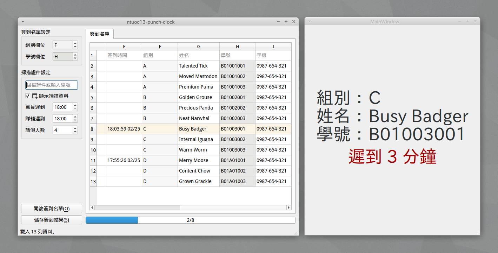

# ntuoc13-punch-clock

Punch clock desktop app for National Taiwan University Orientation Camp.



## Quickstart

```
$ sudo apt install python3.6-venv
$ make start
```

It builds on Python 3.6 for fbs free version.

The app must focus on the input field to obtain inputs from barcode scanner or
keyboard. The name list takes `xlsx` format only.

## Credits

- [PyQt5](https://www.riverbankcomputing.com/software/pyqt/), Python bindings for the Qt cross platform application toolkit.
- [Fman](https://build-system.fman.io/), Create Python GUIs with Qt in minutes.
